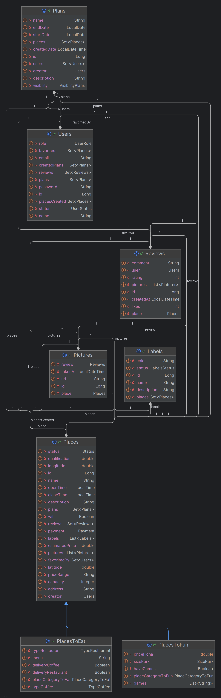

[](https://classroom.github.com/a/Jmnm3svF)

# NexU: La guía universitaria para ahorrar tiempo, dinero y descubrir nuevos lugares

**CURSO:** `CS 2031 Desarrollo Basado en Plataformas`

**INTEGRANTES DEL GRUPO:**
```
| ALUMNO                      |
| --------------------------- |
| Miranda Barrientos          |
| Ticlia Maqui                |
| Villegas Suarez             |
| Pachacutec Aguilar          |
```

# 📘 Índice

1. [INTRODUCCIÓN](#introducción)
2. [IDENTIFICACIÓN DEL PROBLEMA O NECESIDAD](#identificación-del-problema-o-necesidad)
3. [DESCRIPCIÓN DE LA SOLUCIÓN](#️descripción-de-la-solución)
4. [MODELO DE ENTIDADES](#modelo-de-entidades)
5. [TESTING Y MANEJO DE ERRORES](#testing-y-manejo-de-errores)
6. [MEDIDAS DE SEGURIDAD IMPLEMENTADAS](#medidas-de-seguridad-implementadas)
7. [EVENTOS Y ASINCRONÍA](#eventos-y-asincronía)
8. [GITHUB](#github)
10. [CONCLUSIÓN](#conclusión)
11. [APÉNDICES](#apéndices)

## INTRODUCCIÓN


### Contexto:
En el entorno universitario, tanto estudiantes como profesores enfrentan dificultades para encontrar información confiable y actualizada sobre lugares económicos y accesibles para comer, socializar o relajarse cerca del campus. Las aplicaciones tradicionales no siempre están diseñadas pensando en las necesidades específicas de esta comunidad, lo que genera falta de opciones adaptadas a su estilo de vida y limita la experiencia universitaria.

### Objetivo:
Desarrollar una plataforma colaborativa llamada **NexU** que conecte a estudiantes y docentes con lugares cercanos, accesibles y recomendados por la misma comunidad universitaria. La plataforma facilitará el descubrimiento, la valoración y la recomendación de opciones para optimizar tiempo y dinero, mejorando así la calidad de vida dentro y alrededor del campus.

## IDENTIFICACIÓN DEL PROBLEMA O NECESIDAD

### Problema:
La falta de una herramienta específica que reúna información precisa, validada y actualizada sobre lugares económicos y relevantes para la comunidad universitaria genera dificultades para encontrar opciones confiables y adaptadas. Las soluciones generalistas no contemplan el contexto ni las necesidades particulares de estudiantes y docentes, lo que provoca desinformación y limitaciones en la experiencia universitaria.

### Justificación:
Atender esta necesidad es fundamental para toda la comunidad universitaria, permitiendo ahorrar tiempo y dinero, y mejorando la integración social y el bienestar de sus miembros. Además, existen muchos servicios urbanos que no siempre están visibles o bien detallados en otras plataformas, por lo que una solución especializada es necesaria para cubrir esta brecha.


## DESCRIPCIÓN DE LA SOLUCIÓN

### Funcionalidades Implementadas:

1. **Exploración sin registro**: Los usuarios pueden consultar lugares disponibles sin necesidad de registrarse.
2. **Funciones extendidas al registrarse**: Comentarios, creación de planes, publicación de fotos y personalización de preferencias.
3. **Comentarios y fotos**: Los usuarios registrados pueden dejar opiniones y subir imágenes de los lugares.
4. **Planes colaborativos**: Creación de planes personales, públicos o grupales para organizar visitas o encuentros.
5. **Etiquetas por gustos**: Clasificación de lugares según intereses (económico, gótico, pet friendly, etc.).
6. **Mapa interactivo**: Visualización de los lugares en un mapa dinámico gracias a la API de Google Maps.
7. **Notificaciones por correo**: Envío automático de correos electrónicos al registrarse o crear un plan, mediante eventos asíncronos.

### Tecnologías Usadas:

-   **Backend**: Spring Boot
-   **Base de datos**: PostgreSQL y H2 (para pruebas)
-   **Autenticación y seguridad**: Spring Security con JWT (JSON Web Tokens) para control de acceso y protección de endpoints
-   **Almacenamiento**: AWS S3 para guardar imágenes subidas por los usuarios
-   **Mapas**: Google Maps API para visualización de ubicaciones
-   **Correo electrónico**: Protocolo SMTP y tareas asíncronas para envío automatizado (ej: registro de usuarios)
-   **Testing y desarrollo**: H2 Database para pruebas locales y desarrollo rápido; PostgreSQL con TestContainers para pruebas más realistas

## MODELO DE ENTIDADES

### Entidades

-   **Users**: Representa a los usuarios registrados en la plataforma. Contiene información como nombre, correo electrónico, contraseña, estado y rol.
-   **Plans**:Representa planes creados por usuario(s). Contiene nombre, descripción, fechas de inicio y fin, visibilidad (*personal, grupal o público*), fecha de creación automática, lugares asociados y participantes.
-   **Places**: Superclase que representa cualquier lugar registrado. Contiene nombre, dirección, coordenadas, horarios, métodos de pago, estado, descripción, capacidad, etiquetas, imágenes, reseñas, planes y creador.
-   **PlacesToEat**: Subclase de *Places*. Representa lugares de comida como restaurantes o cafeterías. Incluye tipo de comida, si ofrece delivery, categoría, y menú disponible.
-   **PlacesToFun**: Subclase de *Places*. Representa lugares recreativos como parques o centros de juegos. Incluye categoría, lista de juegos, precio por ficha, tamaño del parque y si tiene juegos infantiles.
-   **Labels**: Representa etiquetas asociables a lugares, como "wifi", "pet-friendly" o "económico". Incluye nombre, descripción, color, estado y está relacionada con múltiples lugares.
-   **Reviews**: Entidad débil que depende tanto de un *User* como de un *Place*. Contiene comentario, fecha de creación, calificación (1 a 5), cantidad de likes y posiblemente imágenes.
-   **Picture**: Entidad débil asociada a un *Place* y a una *Review*. Contiene URL de la imagen, clave de almacenamiento (s3Key), fecha de captura, y asegura que esté vinculada a solo uno de los dos (lugar o reseña).

### Relaciones entre entidades:

-   **One-to-Many**:
    -   Entre *Users* y *Reviews* (un usuario puede hacer muchas reseñas).
    -   Entre *Users* y *Plans* (un usuario puede crear múltiples planes).
    -   Entre *Places* y *Reviews* (un lugar puede tener muchas reseñas asociadas).
    -   Entre *Places* y *Pictures* (un lugar puede tener varias imágenes asociadas).
    -   Entre *Reviews* y *Pictures* (una reseña puede contener varias imágenes).
-   **Many-to-Many**:
    -   Entre *Users* y *Plans* (un plan grupal puede incluir varios usuarios, y un usuario puede participar en varios planes).
    -   Entre *Places* y *Labels* (un lugar puede tener varias etiquetas y una etiqueta puede aplicarse a múltiples lugares).

## TESTING Y MANEJO DE ERRORES

### Niveles de Testing Realizados

- **Pruebas Unitarias**: Con JUnit y Mockito.
- **Pruebas de Integración**: Spring Boot Test con PostgreSQL real (TestContainers).
- **Pruebas de Excepciones**: Validación de errores esperados.
- **Simulación de Repositorios**: Mockito para aislar servicios.

### Exceptions:

-   **BadRequestException**: Cuando los datos de entrada son inválidos o faltan campos requeridos.
-   **InternalServerErrorException**: Para errores no controlados del sistema que no deben exponerse al usuario.
-   **ResourcesAlreadyExistException**: Para evitar la creación de recursos duplicados como usuarios o planes existentes.
-   **ResourcesNotFoundException**: Cuando no se encuentra un recurso solicitado, como un lugar o usuario inexistente.

## MEDIDAS DE SEGURIDAD IMPLEMENTADAS

Se utilizó **JPA/Hibernate** para prevenir inyección SQL, evitando el uso de consultas concatenadas. También se implementó seguridad de datos con tokens **JWT** para el registro de usuarios. Cada usuario registrado recibe su token único; además, cada token tiene tiempo de expiración.

## EVENTOS Y ASINCRONÍA

Se implementaron **eventos asíncronos** para tareas como el envío de **correos electrónicos** al registrarse o crear un plan. Estas acciones se procesan en segundo plano para no afectar el rendimiento de la aplicación ni bloquear las respuestas al usuario.

## GITHUB

Se utilizó **GitHub Projects** para gestionar el flujo de trabajo. Las tareas se dividieron en *issues* y se desarrollaron en este orden:

1. **Entities y Repositories**
2. **Controllers y Services**
3. **Funcionalidades extra** (APIs, eventos)
4. **Seguridad con JWT**
5. **Corrección de errores**
6. **Tests con TestContainers y controladores**

Aunque no se utilizó GitHub Actions, el trabajo colaborativo se mantuvo mediante issues, ramas, *pull requests* y revisión continua.

## CONCLUSIÓN

### Logros del Proyecto

Se logró construir un backend robusto que permite a usuarios universitarios interactuar con lugares relevantes mediante planes, comentarios y valoraciones. La API incorpora funciones colaborativas, control de acceso seguro, y una estructura clara para integración con frontend.

### Aprendizajes Clave

- Manejo de **Spring Boot**, **eventos asíncronos**, **JWT**, y **pruebas con TestContainers**.
- Uso de API externa **GoogleMaps** para un mapa interactivo.
- Organización del proyecto en equipo usando **GitHub Projects** y división de tareas efectivas.

### Trabajo Futuro

- Mejoras en la validación de seguridad
- Integración de notificaciones push
- Soporte para reservas o recomendaciones personalizadas
- Desarrollo del frontend conectado a este backend

## APÉNDICES

### Licencia:

`MIT License`

### Referencias

```
[1] Amazon Web Services, "Amazon S3 Developer Guide," 2023. [Online]. Available: https://docs.aws.amazon.com/s3/
[2] Google, "Maps JavaScript API," 2023. [Online]. Available: https://developers.google.com/maps/documentation/javascript
[3] IETF, "RFC 5321: Simple Mail Transfer Protocol," 2008. [Online]. Available: https://datatracker.ietf.org/doc/html/rfc5321
```

### Diagrama


